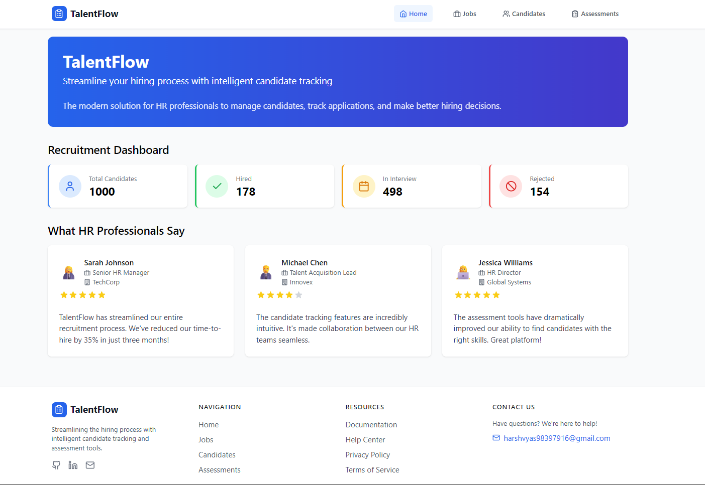
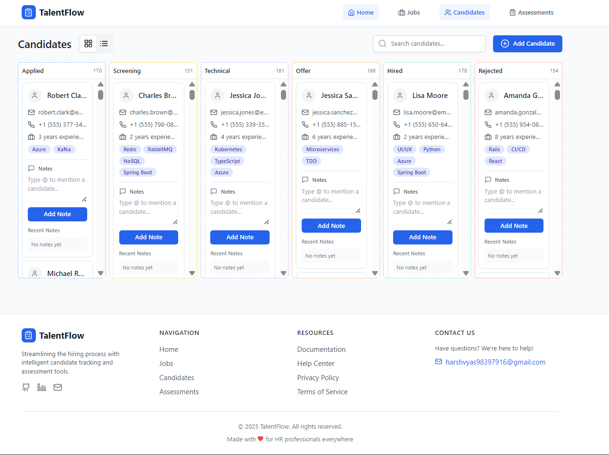
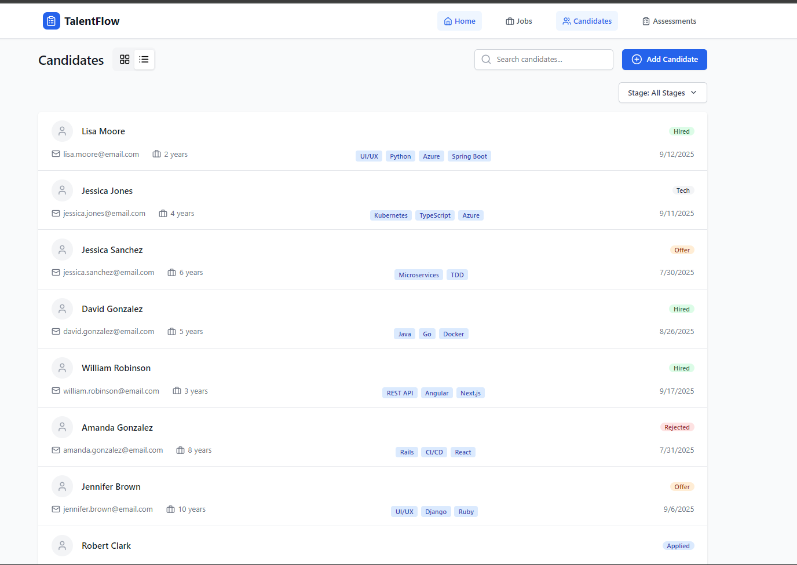
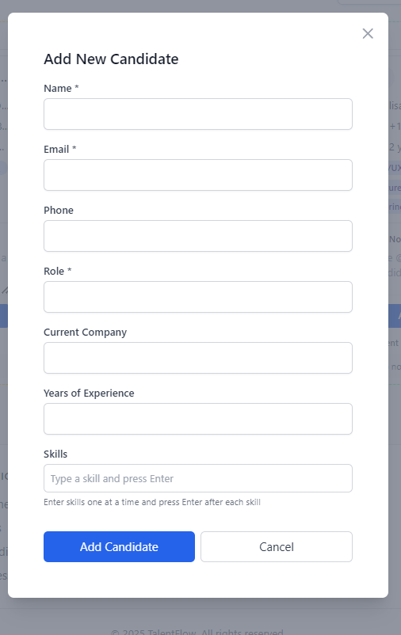
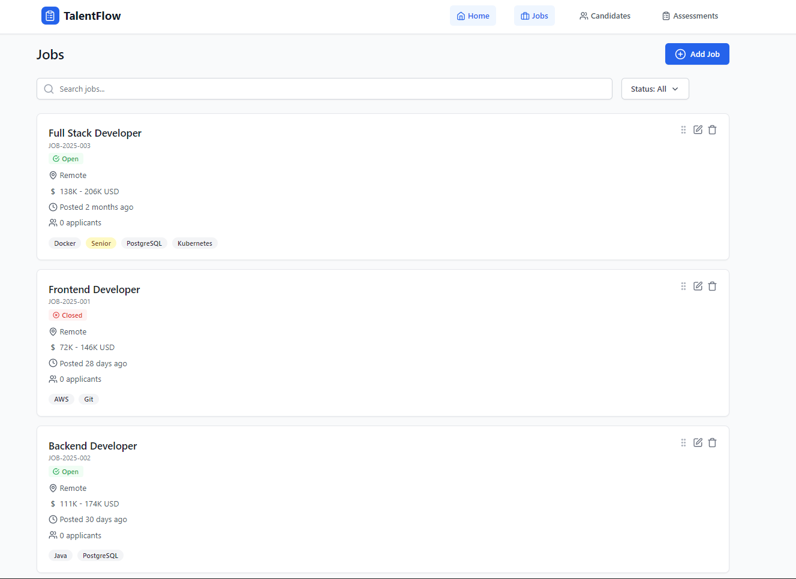
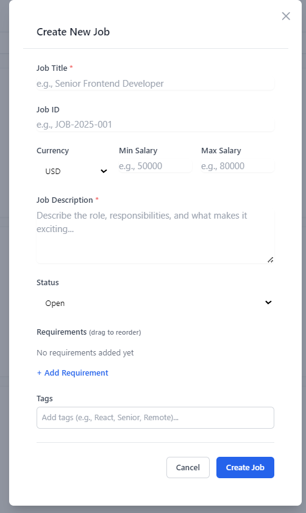
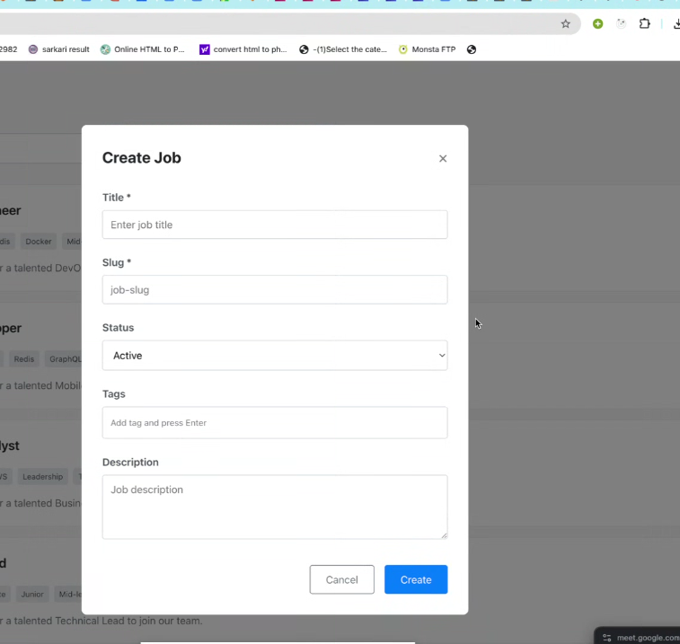
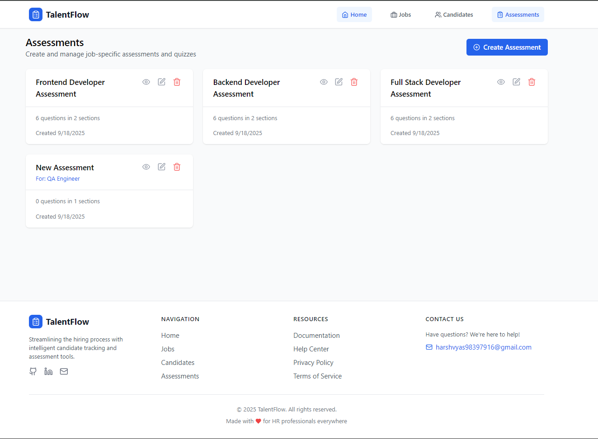
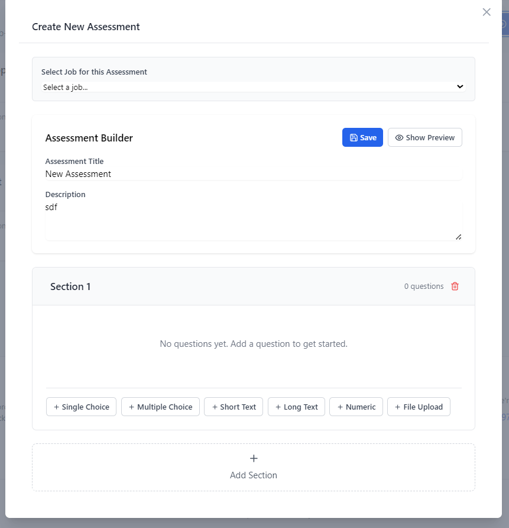

# TalentFlow

TalentFlow is a modern recruiting and talent management platform designed to streamline the hiring process from job posting to candidate assessment.


## Overview

TalentFlow provides a comprehensive suite of integrated tools for talent acquisition teams:

- **Intuitive Dashboard** for at-a-glance recruiting metrics
- **Kanban & List Views** for flexible candidate management
- **Job Posting Management** with customizable requirements
- **Assessment Builder** for skills evaluation
- **Interactive Timeline** for candidate history tracking

## Application Screenshots

### Dashboard & Homepage
<p align="center">
  
</p>

## Key Features

### 1. Candidate Management

Easily track candidates through every stage of your hiring pipeline with flexible views and powerful filtering tools.

<div align="center">
  
  <p><em>Kanban Board: Visualize candidates across hiring stages</em></p>
</div>

<div align="center">
  
  <p><em>List View: Sort and filter candidates efficiently</em></p>
</div>

<div align="center">
  
  <p><em>Candidate Form: Collect comprehensive candidate information</em></p>
</div>

**Features include:**
- Drag-and-drop stage management
- Customizable candidate cards
- @mention-enabled notes system
- Timeline view for activity history
- Skills-based filtering and search
- Interview scheduling tools

### 2. Job Management

Create, organize, and track job postings with comprehensive details and applicant tracking.

<div align="center">
  
  <p><em>Jobs Dashboard: Track all open positions</em></p>
</div>

<div align="center">
  
  <p><em>Job Creation Form: Define detailed position requirements</em></p>
</div>

<div align="center">
  
  <p><em>Job Details: View complete job information</em></p>
</div>

**Features include:**
- Comprehensive job listing management
- Status tracking (Open, Filled, On Hold)
- Customizable job requirements
- Applicant tracking and progression
- Advanced filtering and search capabilities
- Drag-and-drop priority ordering

### 3. Assessment Builder

Create customized assessments to evaluate candidate skills and qualifications.

<div align="center">
  
  <p><em>Assessment Dashboard: Manage all your assessment templates</em></p>
</div>

<div align="center">
  
  <p><em>Assessment Builder: Create customized evaluation tools</em></p>
</div>

**Features include:**
- Multiple question formats (multiple choice, text)
- Customizable scoring systems
- Preview mode for testing assessments
- Candidate-specific assessment assignment
- Results tracking and analysis

## Tech Stack

TalentFlow leverages modern web technologies for performance and flexibility:

- **Frontend**: React 18 with functional components and hooks
- **Build System**: Vite for lightning-fast development
- **Styling**: Tailwind CSS for responsive design
- **State Management**: React Query for server state, local React state
- **Data Storage**: IndexedDB via Dexie.js for client-side persistence
- **Mock Backend**: MSW (Mock Service Worker) for API simulation
- **UI Components**: Custom component library with Lucide icons
- **Drag and Drop**: @hello-pangea/dnd for intuitive interactions

## 🚀 Getting Started

### Prerequisites
- Node.js (v16+)
- npm or yarn

### Quick Start

1. **Clone the repository**
   ```bash
   git clone https://github.com/yourusername/talentflow.git
   cd talentflow
   ```

2. **Install dependencies**
   ```bash
   npm install
   ```

3. **Start the development server**
   ```bash
   npm run dev
   ```

4. **Open your browser**
   Navigate to `http://localhost:5173`

### Available Scripts

- `npm run dev` - Start development server
- `npm run build` - Build for production
- `npm run lint` - Run ESLint
- `npm run preview` - Preview production build

## 🧰 Project Structure

```
src/
├── components/     # Reusable UI components
│   ├── assessments/ # Assessment-related components
│   ├── candidates/  # Candidate management components
│   ├── jobs/        # Job listing components
│   └── ui/          # Core UI elements
├── data/          # Seed data for development
├── pages/         # Route-based page components
├── services/      # API and data management
└── main.jsx       # Application entry point
```

## 📊 Working with Mock Data

TalentFlow uses MSW to simulate a backend API with data stored in IndexedDB:

- Full application workflow without requiring a real backend
- Persistent data between browser sessions
- Realistic API behavior with configurable latency

To reset data, clear your browser's IndexedDB storage through developer tools.

## 🤝 Contributing

We welcome contributions! Please follow these steps:

1. Fork the repository
2. Create a feature branch (`git checkout -b feature/amazing-feature`)
3. Commit your changes (`git commit -m 'Add some amazing feature'`)
4. Push to the branch (`git push origin feature/amazing-feature`)
5. Open a Pull Request

Please follow our coding standards and include appropriate tests.

## 📝 License

This project is licensed under the MIT License - see the [LICENSE](LICENSE) file for details.

## 🙏 Acknowledgements

- [React](https://reactjs.org/)
- [Tailwind CSS](https://tailwindcss.com/)
- [Vite](https://vitejs.dev/)
- [Mock Service Worker](https://mswjs.io/)
- [Dexie.js](https://dexie.org/)
- [React Query](https://tanstack.com/query)
- [React Router](https://reactrouter.com/)
- [Lucide Icons](https://lucide.dev/)

## 🔮 Future Roadmap

- Enhanced analytics dashboard
- Email notification system
- Calendar integration
- Mobile application
- Dark mode support
- Advanced reporting tools

## 📞 Support

If you encounter any issues or have questions, please [open an issue](https://github.com/yourusername/talentflow/issues) or contact our support team.

## Tech Stack

- **Frontend**: React with modern hooks and patterns
- **Build Tool**: Vite for fast development and optimized production builds
- **State Management**: React Query for server state, React hooks for local state
- **Styling**: Tailwind CSS for responsive, utility-first styling
- **UI Components**: Custom component library with Lucide icons
- **Data Storage**: IndexedDB (via Dexie.js) for client-side persistence
- **API Mocking**: MSW (Mock Service Worker) for API simulation
- **Form Handling**: Controlled components with React state

## Project Structure

```
src/
├── components/     # Reusable UI components
│   ├── assessments/ # Assessment-related components
│   ├── candidates/  # Candidate management components
│   ├── jobs/        # Job listing components
│   └── ui/          # Shared UI elements (buttons, cards, etc.)
├── data/          # Seed data and mock information
├── pages/         # Page components and routing
├── services/      # API calls, data fetching and business logic
└── main.jsx       # Application entry point
```

## Getting Started

### Prerequisites

- Node.js (v16 or higher)
- npm or yarn package manager

### Installation

1. Clone the repository
   ```bash
   git clone https://github.com/yourusername/talentflow.git
   cd talentflow
   ```

2. Install dependencies
   ```bash
   npm install
   # or
   yarn install
   ```

3. Start the development server
   ```bash
   npm run dev
   # or
   yarn dev
   ```

4. Open your browser and navigate to `http://localhost:5173`

### Available Scripts

- `npm run dev` - Start the development server
- `npm run build` - Build the application for production
- `npm run lint` - Run ESLint to check for code issues
- `npm run preview` - Preview the production build locally

### Using the Application

- **Jobs**: Navigate to the Jobs tab to create and manage job listings
- **Candidates**: Use the Candidates tab to track applicants through the hiring process
- **Assessments**: Create custom assessments for evaluating candidates

### Working with Mock Data

TalentFlow uses MSW (Mock Service Worker) to simulate a backend API. All data is stored in the browser's IndexedDB, which persists between sessions. This allows you to:

- Test the full application workflow without a real backend
- Create, update, and delete data that persists between browser sessions
- Experience realistic network delays and error handling

To reset the data, you can clear your browser's IndexedDB storage through the developer tools.

## Contributing

We welcome contributions to TalentFlow! Please follow these steps to contribute:

1. Fork the repository
2. Create a new branch for your feature or bugfix
   ```bash
   git checkout -b feature/your-feature-name
   ```
3. Make your changes and commit them
   ```bash
   git commit -m "Add your meaningful commit message here"
   ```
4. Push your branch to your forked repository
   ```bash
   git push origin feature/your-feature-name
   ```
5. Submit a pull request describing your changes

### Development Guidelines

- Write clean, maintainable, and testable code
- Follow the existing code style and naming conventions
- Update documentation for any new features or API changes
- Add appropriate tests for new functionality

## License

This project is licensed under the MIT License - see the [LICENSE](LICENSE) file for details.

## Acknowledgements

- [React](https://reactjs.org/) - UI library
- [Tailwind CSS](https://tailwindcss.com/) - Styling framework
- [Vite](https://vitejs.dev/) - Build tool
- [Mock Service Worker](https://mswjs.io/) - API mocking
- [Dexie.js](https://dexie.org/) - IndexedDB wrapper
- [Lucide Icons](https://lucide.dev/) - SVG icon library
- [React Query](https://tanstack.com/query/latest) - Data fetching library
- [React Router](https://reactrouter.com/) - Routing solution

## Browser Compatibility

TalentFlow is designed to work with modern browsers:

- Chrome (latest)
- Firefox (latest)
- Safari (latest)
- Edge (latest)

## Future Enhancements

We're constantly working to improve TalentFlow. Some planned features include:

- Enhanced reporting and analytics
- Email integration for candidate communication
- Calendar integration for interview scheduling
- Mobile app for on-the-go recruiting
- Dark mode support

## Support

If you encounter any issues or have questions, please open an issue on GitHub or contact the development team.
